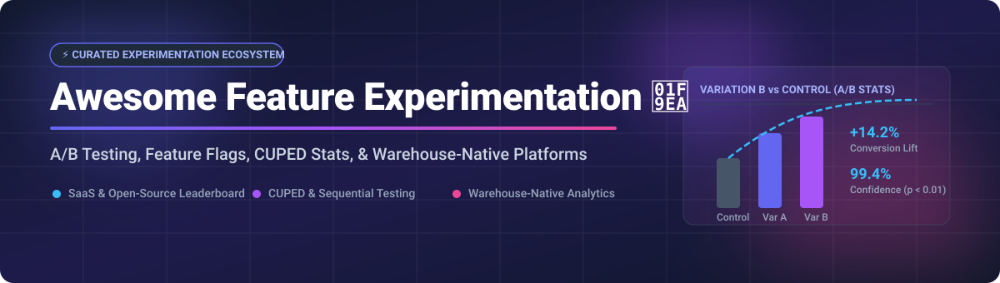

# 🧪 Awesome Feature Experimentation & A/B Testing Ecosystem

  

  
  
  
  

> 🚀 **Curated directory of SaaS platforms, Open-Source GitHub projects, CUPED statistical engines, and Warehouse-Native analytics for Feature Experimentation, A/B Testing, and Progressive Delivery.**

---

## 📚 Table of Contents

- [📊 Market Overview & Industry Dynamics](#-market-overview--industry-dynamics)
- [☁️ SaaS & Hosted Experimentation Platforms](#️-saas--hosted-experimentation-platforms)
- [🛠️ Open-Source GitHub Projects & Frameworks](#️-open-source-github-projects--frameworks)
- [🤝 How to Contribute](#-how-to-contribute)
- [☕ Support & Acknowledgments](#-support--acknowledgments)
- [📈 Star History](#-star-history)
- [⚠️ Disclaimer](#%EF%B8%8F-disclaimer)

---

## 📊 Market Overview & Industry Dynamics

> **Estimated Market Size & Structure:**  
> The global **Feature Management & Experimentation software market** is estimated at **$2.5 Billion+ in 2026** and is growing at ~18-22% CAGR driven by product-led growth (PLG), AI-assisted decision making, and warehouse-native analytics.  
> The market is **moderately fragmented**, featuring legacy enterprise digital experience suites (Optimizely, VWO), agile high-growth specialized platforms (LaunchDarkly, Statsig), data-warehouse-native statistical engines (Eppo), and a rapidly expanding open-source ecosystem (PostHog, GrowthBook, Unleash).

---

## ☁️ SaaS & Hosted Experimentation Platforms

Below is a tabular breakdown of leading commercial SaaS experimentation and feature flag platforms, sorted by **company scale (Valuation / Revenue)** in descending order.

| Platform | Company Scale (Valuation / Est. Revenue) | Starting Paid Tier Price | Free Tier / Trial Limits | Key Features & Focus |
| :--- | :--- | :--- | :--- | :--- |
| **[Optimizely](https://www.optimizely.com/)** 🏢 | **~$1.5B+ Valuation** ($300M+ ARR) | ~$36,000 / year (Custom annual billing) | 14-Day Free Trial (Visual Editor limits apply) | Enterprise web & server-side A/B testing, visual editor, and full-stack digital experience platform. |
| **[LaunchDarkly](https://launchdarkly.com/)** 🚩 | **$3.0B Valuation** ($100M+ ARR) | $8 / seat / month (Starter Plan) | 14-Day Free Trial (Starter features, 1,000 Client-Side MAUs) | Industry-standard feature management infrastructure with integrated experimentation and metric tracking. |
| **[Statsig](https://www.statsig.com/)** 📈 | **~$1.0B Valuation** ($50M+ ARR) | $150 / month (Pro Plan, 5M events included) | **Free Forever**: 2 Million metered events/mo, unlimited seats & flags, 50k session replays. | Advanced statistical engine (CUPED, sequential, Bayesian), automated root-cause analysis, and feature flags. |
| **[VWO](https://vwo.com/)** (Visual Website Optimizer) 🎯 | **~$500M+ Valuation** ($50M+ ARR) | $198 / month (Testing Starter Plan) | **Free Forever**: Up to 50,000 tested users/mo for web testing. | Conversion rate optimization (CRO), heatmaps, visual A/B test editor, and full-stack experiments. |
| **[AB Tasty](https://www.abtasty.com/)** 🧪 | **~$300M+ Valuation** ($40M+ ARR) | ~$1,000 / month (Custom enterprise contract) | 14-Day Free Trial (Demonstration & demo sandbox access) | Client-side and server-side feature experimentation, AI personalization, and customer journey optimization. |
| **[Kameleoon](https://www.kameleoon.com/)** 🤖 | **~$250M Valuation** ($35M+ ARR) | ~$1,200 / month (Custom annual billing) | 14-Day Free Trial (Sandbox environment) | AI-driven experimentation, web A/B testing, real-time personalization, and consent management. |
| **[Eppo](https://www.geteppo.com/)** 🏦 | **$220M Acquisition** (Acquired by Datadog / Datadog Experiments) | ~$450 / month (Datadog Experiments tier) | No Free Tier (Demo request / enterprise evaluation required) | Warehouse-native statistical engine connecting directly to Snowflake, BigQuery, and Databricks with CUPED. |
| **[Convert Experiences](https://www.convert.com/)** ⚡ | **~$50M Valuation** ($10M+ ARR) | $99 / month (Community Plan) | 14-Day Free Trial (Full feature access, up to 50k tested visitors) | Privacy-first, GDPR-compliant web A/B testing with fast visual editor and zero performance flicker. |
| **[GrowthBook Cloud](https://www.growthbook.io/)** 🌳 | **~$30M Valuation** ($5M+ ARR) | $20 / user / month (Pro Plan) | **Free Forever**: Up to 3 users, unlimited feature flags & experiment metrics. | Managed offering of the open-source GrowthBook platform—feature flags, warehouse-native stats engine. |

---

## 🛠️ Open-Source GitHub Projects & Frameworks

Open-source feature flag and experimentation platforms allow complete data ownership and custom warehouse integrations. The list below is sorted by **GitHub Star Count (descending)**.

| Project & Repo Link | GitHub Stars | License | Core Capabilities |
| :--- | :--- | :--- | :--- |
| **[PostHog](https://github.com/PostHog/posthog)** 🦔 |  | MIT / ELv2 | All-in-one open-source product analytics, feature flags, A/B testing, and session recording suite. |
| **[Unleash](https://github.com/Unleash/unleash)** 🔓 |  | Apache-2.0 | Enterprise-grade open-source feature management platform with progressive rollouts and experiment strategies. |
| **[GrowthBook](https://github.com/growthbook/growthbook)** 🧪 |  | MIT | Specialized open-source experimentation & feature flag platform with native SQL warehouse connectors (Snowflake, BigQuery). |
| **[Feast](https://github.com/feast-dev/feast)** 🍱 |  | Apache-2.0 | Open-source feature store for machine learning used to serve, track, and experiment with ML feature variations. |
| **[Flagsmith](https://github.com/Flagsmith/flagsmith)** 🚩 |  | BSD-3-Clause | Open-source feature flag and remote configuration platform supporting user segment targeting and experiment tracking. |
| **[Flagger](https://github.com/fluxcd/flagger)** ⛵ |  | Apache-2.0 | Kubernetes progressive delivery operator that automates A/B testing, Canary releases, and Blue/Green deployments using Service Meshes. |
| **[Argo Rollouts](https://github.com/argoproj/argo-rollouts)** 🐙 |  | Apache-2.0 | Kubernetes Controller supporting advanced deployment strategies like Canary, Blue/Green, and automated analysis. |
| **[OpenFeature Spec](https://github.com/open-feature/spec)** 🌐 |  | Apache-2.0 | CNCF vendor-neutral specification and open standard for feature flag evaluation and experimentation telemetry. |

---

## 🤝 How to Contribute

Contributions are warmly welcome! Help make this curated list the standard resource for feature experimentation.

1. **Fork** this repository. 🍴
2. **Add or edit** entries in `README.md` following the tabular format. 📝
3. Ensure pricing, stars, and company scale metrics are factual and verifiable. 🔍
4. Submit a **Pull Request (PR)** with a summary of changes. 🚀

---

## ☕ Support & Acknowledgments

If you find this repository helpful in evaluating A/B testing platforms, choosing feature flag vendors, or setting up warehouse-native stats:

- ⭐ **Star** this repository to show support!
- 🍴 **Fork** it to keep a copy for your team.
- 📢 **Share** it with fellow product engineers and data scientists.
- 💖 **Sponsor / Buy me a coffee:** Support open-source curation via the [GitHub Sponsor Dashboard](https://github.com/sponsors/ishandutta2007).

---

## 📈 Star History

---

## ⚠️ Disclaimer

- This list is **community-curated** for information purposes and does not constitute financial, product, or statistical endorsement.
- All product names, logos, and brands are property of their respective owners.
